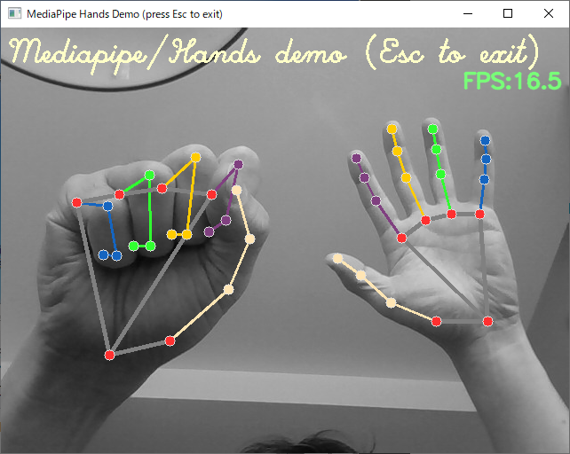

# Naohiro2g/mediapipe_samples

Sample codes for [Mediapipe](https://google.github.io/mediapipe/)

Mediapipe at GitHub: <https://github.com/google/mediapipe>

Mediapipe at Pypi: <https://pypi.org/project/mediapipe/>

### OLD information
*After the release of Mediapipe 0.8.1.0, or at least 0.9.3, the module is compatible with Apple M1. Although I'm not sure if it's compatible also with M2 or later, it seems OK.*

And for your Apple Silicon, or M1 Mac, you can use mediapipe-silicon module forked from mediapipe and build by [cansik](<https://github.com/cansik/>).

Mediapipe-Silicon at GitHub: <https://github.com/cansik/mediapipe>
Mediapipe-Silicon at Pypi: <https://github.com/cansik/mediapipe-silicon>

## "Hands": hands and fingers detection and tracking

- [hands_cam.py](./hands_cam.py) : demo for PC with webcam, and FPS display

### How to run hands_cam.py

```bash
If you have poetry installed:
$ poetry install

else if you have pyenv installed:
$ pyenv local 3.10.11
$ pip install mediapipe opencv-python-headless


Get into the virtual environment, then
$ python hands_cam.py

Press 'esc' key to quit.
```

 hands_cam.py


### How to run hands_mc.py
This is a demo for Minecraft remote. You need to have Minecraft Java Edition and remote controll mod installed on your PC. See [Minecraft Remote](https://github.com/Naohiro2g/minecraft_remote) for details.

### hands_st_01.py
Not yet implemented:
- [hands_st_01.py](./hands_st_01.py) : demo as a web application by [Streamlit](https://streamlit.io/)

